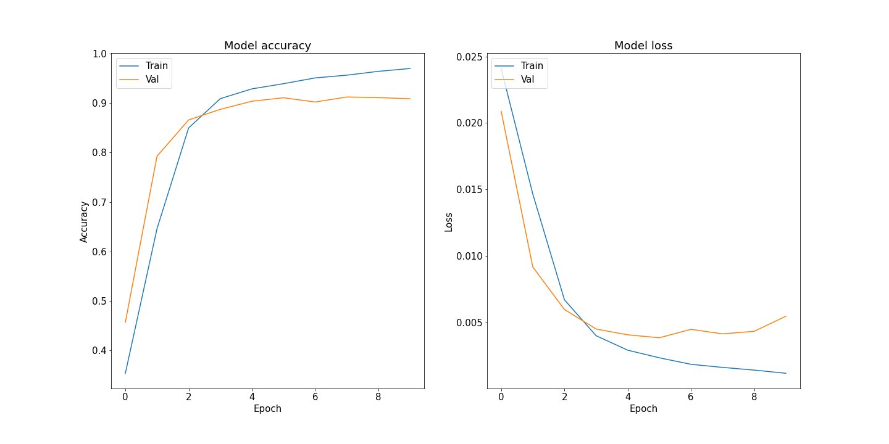
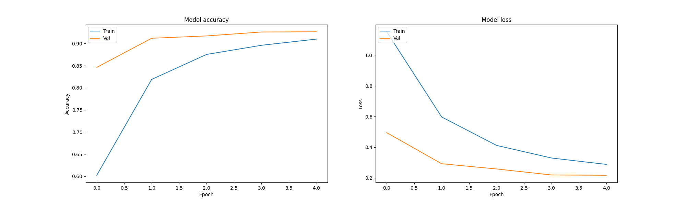

### Introduction

Text summarization is one of the most useful NLP applications that can help users to extract the main information from large documents. Automatic summarization can be either extractive or abstractive, depending on whether the summary is composed of sentences or phrases from the original text or generated by natural language generation techniques. In this notebook, I will explore the task of emotion classification using a dataset of short texts.

### Challenge
Emotion classification is the task of assigning an emotion label to a text, such as anger, fear, joy, love. This task can be useful for understanding the sentiments and opinions of social media users, as well as for providing personalized recommendations and feedback. However, emotion classification is challenging because emotions are subjective and context-dependent, and textual data can be noisy and informal. In this project, I will use a dataset of short texts labeled with six emotion categories: joy, sadness, anger, fear, love, and surprise. 

The dataset contains the list of documents with emotion flag. Also the dataset is split into train, test & validation for building the machine learning model. Here is the link of this dataset:
<a href="https://www.kaggle.com/datasets/praveengovi/emotions-dataset-for-nlp/" target="_blank">link</a>

### Approach

For the classification I use two models as below:

* **LSTM Model** : I will build a deep learning model based on Long Short-Term Memory (LSTM) networks and attention mechanisms to classify the text into their corresponding emotion labels.LSTM networks are a type of recurrent neural networks that can capture long-term dependencies and sequential information in text data. Attention mechanisms are a way of enhancing the representation of the text by focusing on the most relevant parts of the input sequence. 

* **pre-trained RoBERTa model: fine-tuning of a pre-trained RoBERTa model** :The term RoBERTa is an abbreviation of the “Robustly optimized BERT pretraining approach”, and it was introduced by Facebook back in 2019. RoBERTa improves the BERT training by performing four modifications on BERT, i.e., (1) increase the dataset of training (by adding a new large text dataset) and size of the batches, which results in longer model training. (2) remove the NSP prediction, which experiments show that by removing NSP the accuracy of downstream tasks increases. (3) train on longer sequences of words. (4) dynamically changing the masking pattern.

Before training by pre-trained RoBERTa model,  I start with custom **Text Pre-processing**: in  addition to typical stop-word removal, lemmatization, etc. I also did tweet-specific processing: e.g. removing Twitter handles and URLs, transforming emojis into text . 
 

### Results
**The deep-learned RoBERTa-based classifier produced a weighted accuracy of 96% .**

**The LSTM Model produced a weighted accuracy of 90.8% .**

|  |  |
|:---:|:---:|
| Accuracy/Loss of LSTM Model|Confusion Matrix of LSTM Model|

|  |  |
|:---:|:---:|
| Accuracy/Loss of Roberta Model|Confusion Matrix of Roberta Model |

    python==3.10.6
    pytorch==2.0.1+cpu
    torch-scatter==2.1.1+pt20cpu
    torch-sparse==0.6.17
    torch-geometric==2.4.0